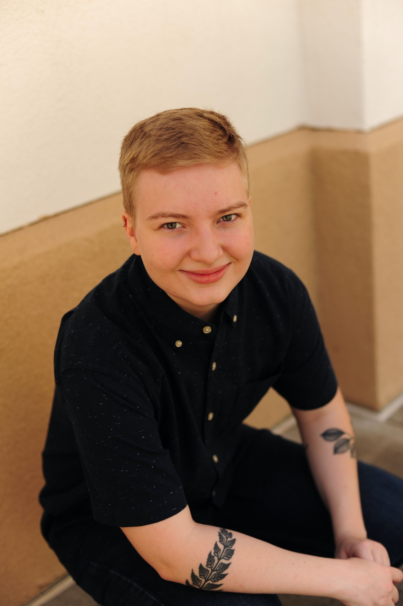
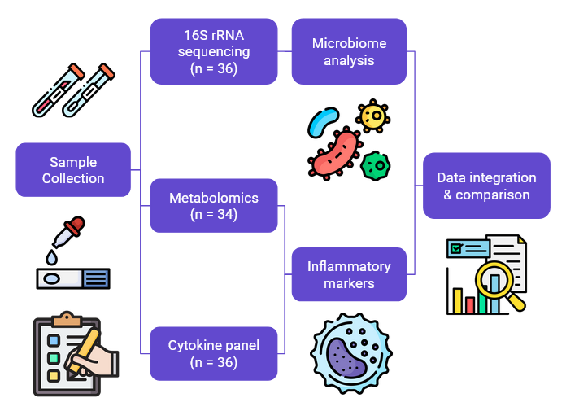

<!-- Home Section -->

Hello, I’m Scout Osborne! This site showcases my work, CV, and research projects.

<!-- Social Icons -->

  
  
  
  

---

<!-- About Section -->

# About Me
I am an MD-PhD student at Case Western Reserve University with a background in biomedical research, global health, and social justice advocacy. My path has taken me from studying molecular biology in the U.S. to virology research in Honduras.

My research has focused on infectious diseases from viral oncology research on Kaposi’s sarcoma-associated herpesvirus to global health projects on dengue fever. These experiences have fueled my passion for addressing health inequities through both rigorous science and patient-centered care.

Clinically, I am drawn to family or internal medicine. I hope to integrate my research training with a career that bridges infectious disease, global health, and primary care.

Please feel free to [contact me](mailto:scout.osborne@case.edu) if you have any questions or would like to discuss potential projects.

---

<!-- CV Section -->

# Curriculum Vitae
[Download my CV](assets/files/Scout_Osborne_CV.pdf)  

---
<!-- Projects Section -->

# Projects

#### Defining the Neovaginal Microbiome after Gender-Affirming Vaginoplasty

Gender-affirming vaginoplasty is increasingly common, yet little is known about the microbial environment of the surgically constructed neovagina. Bacterial vaginosis (BV) is a common pathology post-vaginoplasty. In this project, we compare neovaginal microbial and inflammatory profiles to the cisgender vagina and evaluate clinical symptoms.

Structured surveys, Pap smears, and neovaginal swabs have been collected from 36 transfeminine participants. Swabs have undergone 16S rRNA sequencing, cytokine profiling, and untargeted metabolomics.

*Figure 1: Workflow of sample collection and analysis.*

The neovaginal microbiome is highly diverse and distinct from the cisgender vagina. Healthy cisgender samples are Lactobacillus-dominated, while neovaginal samples have almost no Lactobacillus. Neovaginal communities resemble BV-associated cisgender vagina but contain more Peptoniphilus and Anaerococcus. Vaginal discharge drives elevated pro-inflammatory cytokines and metabolite shifts, with unique immune signatures compared to cisgender samples.

The transfeminine neovagina represents a distinct microbial and immunological niche. High diversity, consistent Lactobacillus depletion, and symptom-associated inflammation highlight the need for neovagina-specific diagnostics and management.
